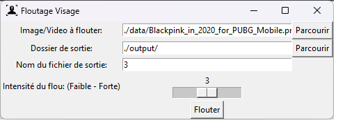
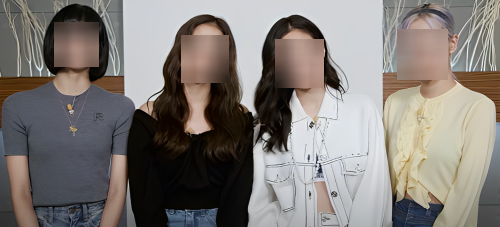

# floutage-visage
Ce projet propose une application graphique simple et efficace pour protéger la vie privée en floutant les visages dans les images et les vidéos. Que vous cherchiez à préserver l'anonymat dans des photos de groupe ou à garantir la confidentialité dans des séquences vidéo, cet outil vous offre un moyen rapide et intuitif de flouter les visages.

Icône : Anonyme icône crée par Freepik - Flaticon

## Fonctionnalités

- **Floutage Personnalisé :** Ajustez l'intensité du flou pour répondre à vos besoins spécifiques.
- **Interface Graphique :** Utilisez l'interface utilisateur intuitive pour sélectionner facilement les fichiers source et définir les paramètres de sortie.

## Exemple

Voici un exemple concret pour illustrer l'utilisation de l'application sur une photo des Blackpink.

### Image d'Entrée

  
"Blackpink in 2020 for PUBG Mobile" by https://www.youtube.com/channel/UCkBoytA_J2Mx6UQkkITCV_w is licensed under CC BY 3.0.

### Résultat

- Intensité du flou : 1
  

- Intensité du flou : 3
  

